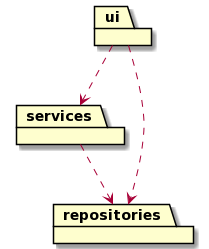
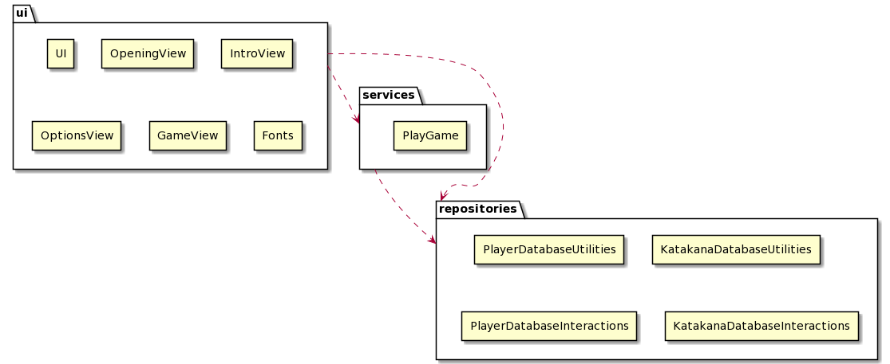
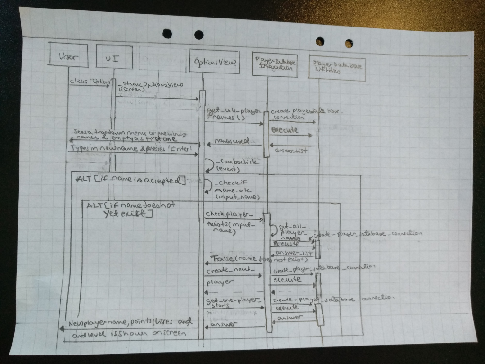
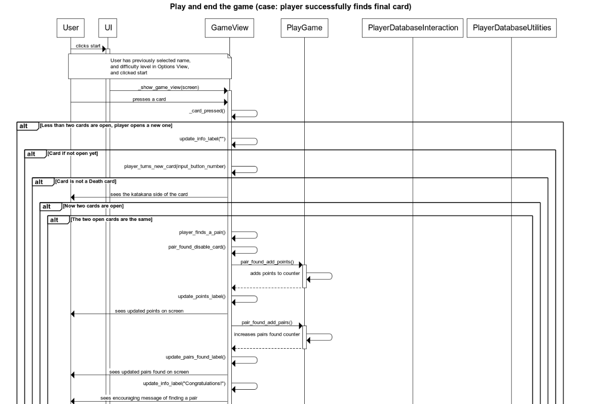
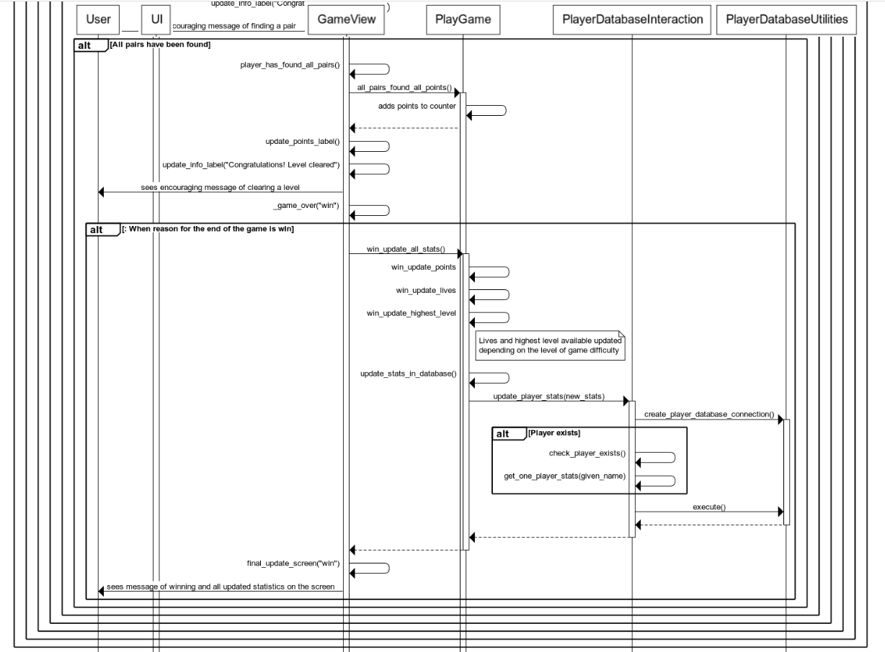

# Description of the Application Architecture

## Structure

Application has three layers: presentation tier (UI), logic tier (services), and data tier (storage of data). Code is packaged as follows:

_ui_, _services_, and _repositories_ packages include the code for the user interface, game logic, and long-term storage and handling of data, respectively. 

## User Interface (UI)

User interface has four different views: 

- Opening view,
- Introduction view,
- Options view, and
- Game view

Each of the views is implemented as their own class. Only one of the views is visible at any given point of time. The success/failure in the game in shown in the Game View at the end of the game.

[UI](../src/ui/ui.py) class is responsible for showing each of the views. UI class also includes the common functionalities for all the views (e.g. common buttons for moving between different views). Each of the views is drawn on a dedicated frame within the overall UI. 

User interface is intended to be separate from the game logic. UI related classes call on methods from the repositories [PlayerDatabaseInteraction](../src/repositories/playerdatabaseinteraction.py), [KatakanaDatabaseInteraction](../src/repositories/katakanadatabaseinteraction.py), and [PlayGame](../src/services/playgame.py) classes.

The most important UI classes are the following ones. 

In the [OptionsView](../src/ui/optionsview.py), the player sets the basic variables for the game to be played. Class offers, e.g., the following core functionalities:
- '_choose_name_for_game(self)'
- '_check_if_name_ok(self, proposed_name)'
- '_generate_level_buttons(self)'
- '_select_game_level(self, selected_game_level_button)'
- '_update_current_game_optios(self)'

In the [GameView](../src/ui/gameview.py), the player interacts with the game, flipping cards and collecting points. Class offers, e.g., the following core functionalities: 
- '_draw_game_view(self)'
- '_set_up_game_board(self)'
- '_card_pressed(self, input_button_number)'
- 'draw_game_stats(self)'
- 'draw_player_stats(self)'
- '_game_over(self, reason_for_end)'
- 'final_update_screen(self, result)'

## Game Logic

Class [PlayGame](../src/services/playgame.py) includes the activities that result from the player interacting with the game. Class interacts with the [GameView](../src/ui/gameview.py) class, and offers, e.g., the following core functionalities:
- 'pair_found_add_points(self)'
- 'death_card_reduce_lives(self)'
- 'get_card_list(self)'
- 'win_update_all_stats(self)'
- 'loss_update_all_stats(self)'
- 'update_stats_in_database(self)'

The full game logic is descibed below (based on current level of implementation): 

## Long Term Storage of Data

First purpose of the classes in repositories is to create and store the data used by the application in the long term. Second task is to provide access to the data in the databases.

### Creating databases and storing data

There are two classes for the storage of data. [KatakanaDatabaseUtilities](../src/repositories/katakanadbutilities.py) creates access to the Katakana database (SQLite database) and populates the database with katakanas used in the game. Database also stores specifications for the different levels of the game (e.g. number of cards and types of katakanas to be learnt). 

[PlayerDatabaseUtilities](../src/repositories/playerdbutilities.py) sets up and creates access to the Player database (SQLite database). Player database includes all the players in the game and their data (e.g. points collected, game levels reached). Player database also stores specifications for the game that is currently played (e.g. name of the player, level being played). 

Both of these databases are initialized at the start of the game.

### Getting data from the databases

There are two classes that provide access to the databases for the _ui_ and _services_ layers. _ui_ and _services_ classes do not directly interact with the database. 

[KatakanaDatabaseInteraction](../src/repositories/katakanadatabaseinteraction.py), provides, e.g., the following services: 
- '_get_game_specs(self, level)'
- '_get_cards_for_game_board(self, level)'

[PlayerDatabaseInteraction](../src/repositories/playerdatabaseinteraction.py), provides, e.g., the following services: 
- '_create_new_player(self, given_name)'
- '_check_player_exists(self, given_name)'
- '_get_current_game_specs(self)'

## Main Functionalities

Here are selected sequence diagrams of the application's key functionalities

### Creation of a new player

One of the key functionalities in the game is the creation of a new player.

When the user has opened the game and entered the Options view by pressing _Options_ button in the UI, the user is presented with a drop-down menu of previously used player names from which to select. The user can also type in a new name and press _Enter_ after which a new player is created and the statistics for this new user are printed on the screen.

The following sequence diagram shows how the information flows during this process. For the sake of simplicity, only the case, where the name is acceptable and a new player can be created, is presented.

### Playing the game and the end of the game

Another one of the key functionalities in the game is playing the game as well as the end of the game. The following sequence diagram shows operations and the information flow in the final round of the game, when the user succesfully finds all the pairs in a given level, leaving only "Sudden Death" cards on the table. 

## Development Areas in the Application Structure

### User Interface

It is important to note that the UI interacts directly with the repositories in the `OptionsView`. One might argue whether some of these activities should be in a separate class. The number of interactions is, however, limited (e.g. getting names available from the database via `PlayerDatabaseInteraction` class), and hence were considered not to merit their own class.

A few issues highlighted by pylint has been left in the code, such as certain unnecessary if - else combinations and a few instances of repeat code (both left for the sake of clarity), and high number of instance variables (considered relevant for the specific classes).

### Game Logic

Some of the interactions between the `GameView` and `PlayGame` classes could be implemented as functions, e.g. getting current points, instead of referring directly to the variables in the `PlayGame` class. 