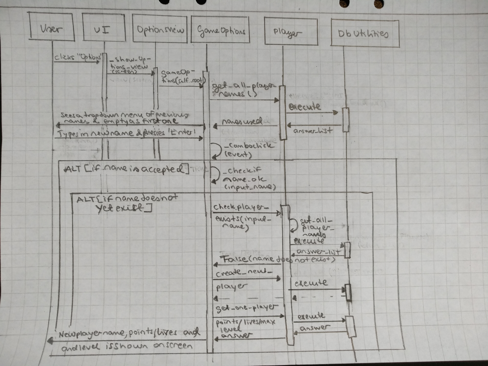

# Description of the Application Architecture

## Structure

Application has three layers: presentation tier (UI), logic tier (services, entities), and data tier (storage of data). Code is packaged as follows: 

_ui_, _services_, _entities_, and _repositories_ packages include the code for the user interface, game logic, primary classes using data structures (e.g. player functionalities), and long-term storage of data, respectively. 

Note: Implementation of especially the data tier, i.e. repositories package, is work in progress, as well as creation of links in code between packages.

## User Interface (UI)

User interface has six different views (of which four have been implemented): 

- Opening view
- Introduction view
- Options view
- Game view
- Success view, and
- Failure view

Each of the views is implemented as their own class. Only one of the views is visible at any given point of time. 

[UI](../src/ui/ui.py) class is responsible for showing each of the view. UI class also includes the common functionalities for all the views (e.g. common buttons for moving between different views). Each of the views is drawn on a dedicated frame within the overall UI. 

User interface is intended to be separate from the game logic. UI related classes call on methods from the [GameOptions](../src/services/gameoptions.py) and [PlayGame](../src/services/playgame.py) classes, which interact with the other classes (work in progress).

## Game Logic

Game logic is work in progress. 

At the beginning of the game, player sets the basic variables for the game to be played in the [GameOptions](../src/services/gameoptions.py) class. At the moment, class offers the following core functionalities, such as
- '_choose_name_for_game(self)'
- '_check_if_name_ok(self, proposed_name)'

Class is to include functionalities for selecting e.g. difficulty level of the game. Class is yet to be linked with the [PlayGame](../src/services/playgame.py) class.

At the moment, the core game logic had been developed in [PlayGame](../src/services/playgame.py) class. Class offers core functionalities to play the memory game, such as
- '_set_up_game_board(self)'
- '_generate_game_list(self, wanted_pairs, wanted_sudden_deaths)'
- '_card_pressed(self, input_button_number)'
- '_game_over(self, message)'

Regarding the main ways to use Player's individual data, [Player](../src/entities/player.py) class provides e.g. the following key functionalities: 
- 'create_new_player(self, given_name)'
- 'get_one_player_stats(self, given_name)'
- 'update_player_stats(self, new_stats)'

Class is the primary link with the [DbUtilities](../src/repositories/dbutilities.py). 

The full game logic is descibed below (based on current level of implementation): 

## Long Term Storage of Data

Purpose of the classes in repositories is to store the data used by the application in the long term. 

### Files

There are to be two classes for the storage of data: one for storing the player data and statistics, and other for storing the katakanas used by the game.

At the moment, [DbUtilities](../src/repositories/dbutilities.py), which sets up a database with player data, is established (work in progress). Player data is stored in an SQLite-database in a table called 'Players'. Player database is initialized at the start of the game. 

Database for katakanas is yet to be developed.

Configuration file has not yet been developed.

## Main Functionalities

Here are selected sequence diagrams of the application's core logic.

### Creation of a new player

One of the key functionalities in the game is the creation of a new player.

When the user has opened the game and entered the Options view by pressing _Options_ button in the UI, the user is presented with a drop-down menu of previously used player names from which to select. The user can also type in a new name and press _Enter_ after which a new player is created and the statistics for this new user are printed on the screen.

The following sequence diagrams shows how the information flows during this process (hand drawn version as the first draft). For the sake of simplicity, only the case, where the name is acceptable and a new player can be created, is presented.

### Other Functionalities

To be defined.

## Development Areas in the Application Structure

### User Interface

Visuals to be improved in all views.

### Game Logic

Game logic to be finalized.

### Repositories

Data layers to be expanded and finalized.