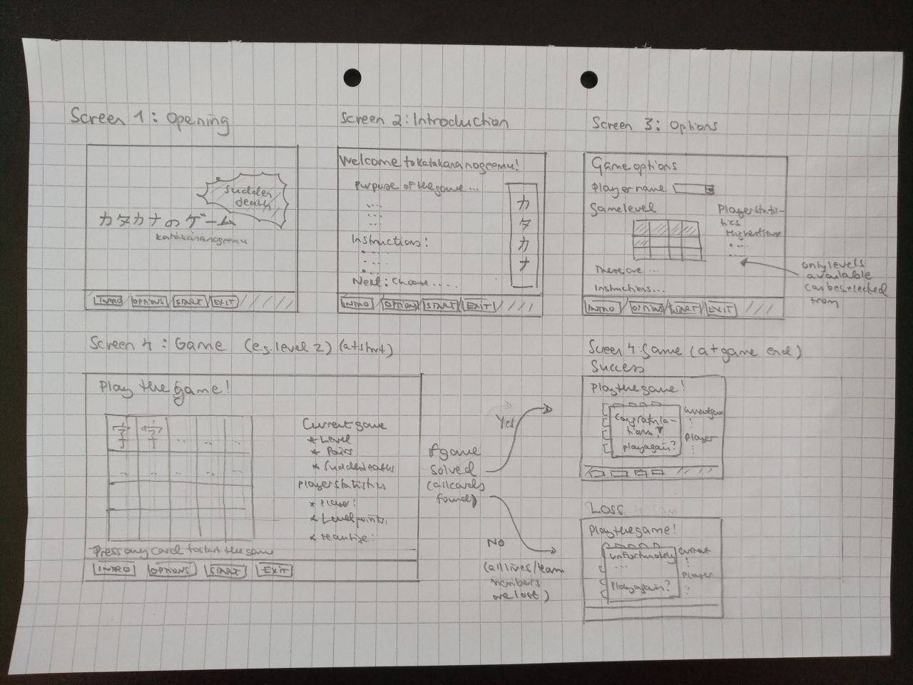

# Requirements Specification Document 

## Application Purpose

Purpose of the **Katakana no Geemu - Sudden Death** is to learn to read Japanese katakana symbols quickly in a fun and interactive way. 

Katakana is one of the three Japanese syllabary, along with hiragana and kanji (and in some cases the Latin script (known as roomaji)). 

The game is a modified version of a basic memory game (find the pairs game). The player needs to pick two cards with the same symbol from a set of turned over cards. There are a few "Sudden death" cards included in the set of cards, which cause the player to lose lives (shown as team members). There are multiple levels in the game. As levels increase, katakana characters become more difficult, and the number of cards and "Sudden death" cards is increased.

## User Groups

There is only one type of role in the application, normal user, i.e. a player. 

## User Interface Draft

The game has four different screens. 

To allow moving between screen, the same menu is shown at the bottom of every screen.

## Basic Version Functionalities

### High level functionalities by screen 
* Screen 1 shows the name of the game and allows the player to go to the introduction and options screens, to start the game with default functionalities, or to exit.
* Screen 2 outlines the purpose of the game and the instructions for playing.
* In screen 3, the player can input or select a name for him/herself, and choose the level of the game to be played. If they choose nothing, default options are set.
* In screen 4, a game board is set. Selected game's spedifications and players' statistics in the level are shown.
* If the level is cleared (all identical pairs of katakana cards are identified, "Sudden death" cards may be left of the table unopened), game ends as a win, and this is shown on top of the game board.
* If level is not cleared (the entire team is eliminated in the attempt), game ends as a loss, and this is shown on top of the game board. 
* In both cases, player can continue to play the same level again or choose another game from the options.

### Functionalities as a list
User can...
* Read the instructions for the game
* Set or select a name for themselves
* Choose the difficulty level of the game (up to level 3, if nothing has been played before; total count of levels is 12)
* Turn around up to two cards at the same time by selecting the card with a press of a mouse

The game will...
* Assign a default name for the player (if not selected or inserted by the player)
* Select a default difficulty level (if not chosen by be player)
* Allow moving between screen with dedicated buttons (same menu structure on every page (buttons for Intro, Options, Start and Exit)
* Show all the levels available in the game and highlight the ones available for the player
* Show the statistics for the player selected (on options screen) (e.g. highest level the player can play, total points collected)
* Show a game board for the player
* Disable cards on the table when a correct pair is identified
* Show the specifications for the game that is being played (e.g. number of pairs to be found, number of Sudden death cards to avoid)
* Show the statistics for the player during the game (e.g. points collected, team size (lives) left)
* Eliminate a team member if a card with "Sudden Death" item is opened
* At the end of the game, save the player's updated statistics (e.g. points, team size (lives), potential new highest level available) to a database

## Future Development Improvement Ideas

* Player could choose whether to show roomaji on cards as hints or not (currently shown in all levels), or match different kind of cards (e.g. katakana in one card and roomaji in another without)
* Improve visuals/graphics of the game (background pictures, special effects in cases of success or "Sudden death")
* Allow selection of team members with different characteristics (e.g. no elimination even in the case of "Sudden death" cards)
* Add a timer or time counter to track the progress of the game; track fastest times to solve and learn levels

## Limitations to be Considered

* Application needs to run on Windows and Linux desktop computers
* Data is stored on the user's computer