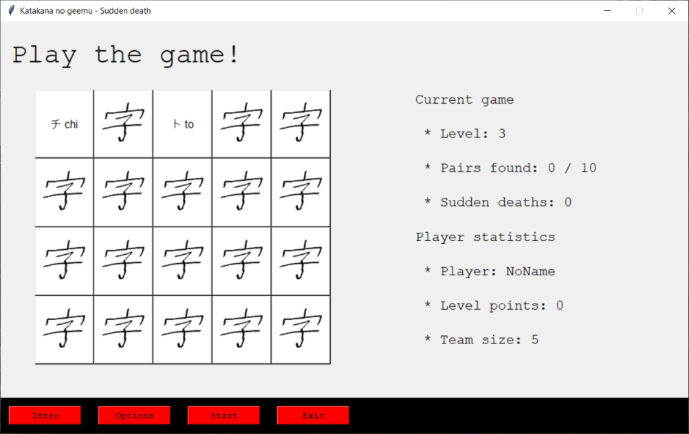

# Instructions

Get the latest release [release](https://github.com/katriryt/ot-harjoitustyo/releases/tag/viikko7) of the game from here. 

## Starting the application

Install dependencies with the following command:

```bash
poetry install
```

Note: if you are running the program on Ubuntu, you may need to install Japanese fonts with the following command: 

```bash
sudo apt install fonts-takao-mincho
```

Start the application with the following command: 

```bash
poetry run invoke start
```


## What next?

To get instructions for the game, select _Intro_ from the opening view. To choose what kind level of game to play, select _Options_ from the opening view. If you want to just start the game, press _Start_. Game closes by pressing _Exit_ button.


## Understand the game

Instructions for the game are available when you press _Intro_. You can go to instructions at any point in time. 


## Choose game level

You can choose or set-up a name for yourself in the game. Just select from the drop down menu an existing player or type in the box your player name. When you type a new name, you create a new player for the game, who starts the game with default set-ups.

Next, choose which level of the game you want to play; game automatically shows levels available for you. Please note that levels are designed so that you benefit from learning the katakanas on lower levels to be able to learn the katakanas on higher difficulty levels more easily. Levels become available for you in groups, where katakanas are of similar type. You can play the same level as many times as you want.


Press _Start_ to start the game of your choosing.

If you do not select a name or a game level, you start the game with the default set-up.

## Play the game

Click cards to flip them around. You can only have 2 cards open at a time. 
If you find a pair, you get points! If you get a Sudden Death card, you lose team members (lives). 




Game is over, when all the cards have been identified and there are only Sudden Death cards left on the table, or when you have consumed all the team members (lives) in the level.

If you succeed in clearing the level, you will gain e.g. additional points, team members (lives), and as you progress, new levels to play. And of course, you will learn katakanas! If you do not succeed, you will be given a chance to continue playing, but you will not gain points.

You can always choose another level for your game by returning to the Options view with by clicking _Options_ button.

Note that as you click through the cards, when you are almost done with a given column, the column in question squeezes. Do not be alarmed! It indicates that you are almost done!
