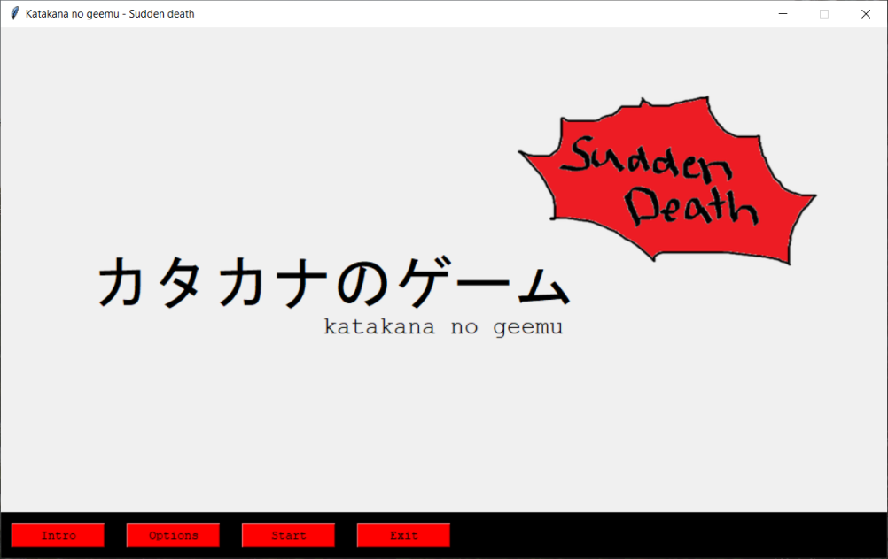

# Instructions

Get the latest release [release](https://github.com/katriryt/ot-harjoitustyo/releases/tag/viikko6) of the game from here. 

## Configuration

Not available at the moment.

## Starting the application

Install dependencies with the following command:

```bash
poetry install
```

Start the application with the following command: 

```bash
poetry run invoke start
```

## What next?

To get instructions for the game, select _Intro_ from the opening view. To choose what kind level of game to play, select _Options_ from the opening view. If you want to just start the game, press _Start_. Game closes by pressing _Exit_ button.



## Choose game level

You can choose or set-up a name for yourself in the game. Just select from the drop down menu an existing player or type in the box your player name. 
Then choose which level of the game you want to play; game automatically shows levels available for you.


Press _Start_ to start the game of your choosing.

## Play the game

Click cards to flip them around. You can only have 2 cards open at a time. 
If you find a pair, you get points! If you get a Sudden Death card, you lose lives. Game is over, when all the cards have been identified and there are only Sudden Death cards left on the table


You can always choose another level for your game by returning to the Options view with by clicking _Options_ button. 

