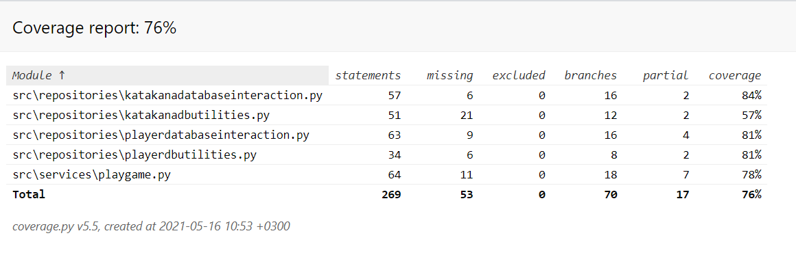

# Testing document

Program has been tested both manually and automatically with unit and integration tests with unittest.

## Unit and integration tests

### Game Logic

`PlayGame` class is tested with [TestPlayGame](../src/tests/playgame_test.py) test class. It is important to note that tests are carried out in the real databases. Their impacts are cleaned from the database after every test. 

### Repository Classes

Repository classes `KatakanaDatabaseUtilities`, `KatakanaDatabaseInteraction`, `PlayerDatabaseUtilities`, and `PlayerDatabaseInteraction` are tested with [TestKatakanaDatabaseUtilities](../src/tests/katakanadbutilities_test.py), [TestKatakanaDatabaseInteraction](../src/tests/katakanadatabaseinteraction_test.py), 
[TestPlayerDatabaseUtilities](../src/tests/playerdatabaseutilities_test.py), and 
[TestPlayerDatabaseInteraction](../src/tests/playerdatabaseinteraction_test.py), respectively.

As above, tests are carried out in the real databases, and their impacts are cleaned from the database after every test.

### Test Coverage

Overall test coverage is 76%, excluding the user interface layer.

Certain less relevant features, such as testing for every if-else combination in the `PlayGame` class, are not covered in the tests.

## System testing

Application's test in different operations systems has been done manually.

### Implementation

Application has been downloaded and tested as in line with the [Instructions](./preliminary_instructions.md) document in Windows 10 and Linux (WSL Ubuntu) environments.

Application has been tested in situations, where the katakana and player databases have existed and where the program has created them.

### Features

All features in the [GameDesignDocument](./game_design_doc.md) have been tested. Erroneous input has been tried to fill in where relevant.

## Remaining quality errors

A few issues highlighted by pylint has been left in the code, such as certain unnecessary if - else combinations and a few instances of repeat code (left for the sake of code clarity), and high number of instance variables (considered relevant for the specific classes). Application may require installation of the Japanese character fonts. Command to do this in Ubuntu has been outlined in the [Instructions](./preliminary_instructions.md).
